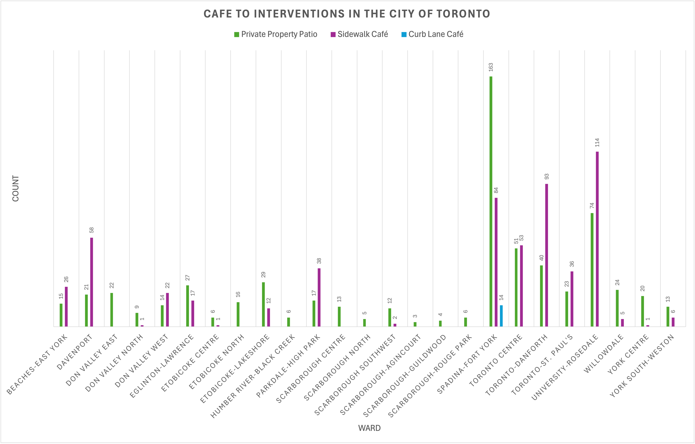

# Data Visualization

## Assignment 3: Final Project (Part 2 - Excel Visualization)

### CaféTO Interventions in the City of Toronto
 
    
    > What software did you use to create your data visualization?
    I used Microsoft Excel to create the bar chart. Excel’s built-in pivot table and chart tools made it easy to summarize and visualize categorical data like café counts per ward.

    > Who is your intended audience? 
    The intended audience includes Toronto city planners, municipal policymakers, BIAs (Business Improvement Areas), and engaged residents who are interested in the distribution of public space for outdoor dining across the city.

    > What information or message are you trying to convey with your visualization? 
    The main message is that the number of CaféTO installations varies significantly across wards. This may reflect differences in commercial density, municipal support, or infrastructure. The chart helps highlight where the program is most active and where it might be underutilized.

    > What aspects of design did you consider when making your visualization? How did you apply them? With what elements of your plots? 
    A bar chart was chosen because it clearly compares quantities across categories (in this case, wards). I also added axis labels and a chart title for clarity.
    I considered clarity, order, and comparability in the chart’s design:

        - I labeled each bar with the corresponding count.
        - I added a clear chart title and axis labels.
        - I used a simple color palette to maintain readability and avoid visual clutter.
    
    > How did you ensure that your data visualizations are reproducible? If the tool you used to make your data visualization is not reproducible, how will this impact your data visualization? 
    Since Excel is not a fully scriptable tool, the visualization is only semi-reproducible. I kept a copy of the raw data and recorded the steps (e.g., filtering, pivot table creation, chart formatting). However, because Excel relies on manual input, exact replication may be difficult without step-by-step documentation. This limits scalability and reproducibility, especially for larger or dynamic datasets.

    > How did you ensure that your data visualization is accessible?  
    To improve accessibility, I:

    - Used high-contrast colors and a simple font.
    - Included text labels for each bar to reduce reliance on interpreting the x-axis scale.
    - Avoided unnecessary visual effects like 3D charting, which can distort perception. 
    

    > Who are the individuals and communities who might be impacted by your visualization?  
    The visualization may impact:

        - Local business owners, who might use this information to advocate for more support in their ward.
        - City officials and planners, who could use the chart to evaluate program equity and reach.
        - Residents, particularly in underrepresented wards, who may question why their neighborhoods lack CaféTO access.

    > How did you choose which features of your chosen dataset to include or exclude from your visualization? 
    I focused only on ward-level counts, excluding details like exact addresses, BIA membership, or café type. This decision was made to keep the visualization clear and comparative across wards. Including more features may have cluttered the chart or required multiple layers of information, better suited to a different format like a map.

    > What ‘underwater labour’ contributed to your final data visualization product?
    Some key “invisible” work included:

    - Collecting and entering the data for the number of and type of CaféTO intervention across Toronto.
    - Exploring and understanding the dataset, including decoding terminology and checking for missing values.
    - Filtering incomplete entries, such as rows missing ward data.
    - Manually creating and formatting pivot tables and bar charts.
    - Iterating design choices (e.g., reordering bars, testing label formats) to improve readability.
    This behind-the-scenes effort was essential to produce a clean, communicative chart.

 