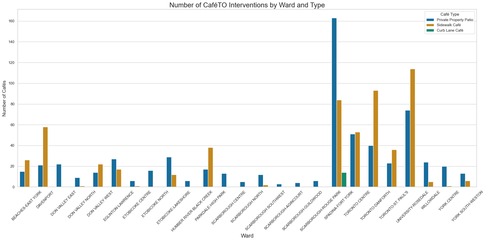

# Data Visualization

## Assignment 3: Final Project (Part 1 - Python Visualziation)

### CaféTO Interventions in the City of Toronto

 

> What software did you use to create your data visualization?

I used Python with the pandas, Seaborn, and matplotlib libraries. Pandas handled data wrangling, while Seaborn and matplotlib were used to create and customize the grouped bar chart.

> Who is your intended audience?

My intended audience includes Toronto city planners, policy makers, local business associations (BIAs), and community members who want to understand how CaféTO interventions are distributed across the city’s wards.

> What information or message are you trying to convey with your visualization?

The visualization shows how different types of CaféTO interventions (e.g., Curb Lane, Sidewalk Cafés) are distributed across Toronto’s wards. It highlights which wards have a high concentration of outdoor dining infrastructure and reveals disparities in participation or access.

> What aspects of design did you consider when making your visualization? How did you apply them? With what elements of your plots?

I focused on readability, clarity, and comparability:
- Used grouped bars to enable comparison between intervention types within each ward.
- Chose a distinctive color palette (Seaborn’s Set2) for accessibility and contrast.
- Added value labels on each bar to show exact counts and reduce reliance on the y-axis.
- Labeled axes clearly and rotated x-axis labels for better readability.
    
> How did you ensure that your data visualizations are reproducible? If the tool you used to make your data visualization is not reproducible, how will this impact your data visualization?

The visualization is fully reproducible through Python code. I used a script-based workflow where all steps—from reading the data to generating the plot—are encoded in a Python file. This means anyone with the dataset and code can recreate the visualization exactly, ensuring transparency and replicability.

> How did you ensure that your data visualization is accessible?

I used a high-contrast, colorblind-friendly palette and included text labels on each bar to improve accessibility for those with visual impairments or difficulty reading axes. The font sizes were also adjusted for legibility. For broader accessibility (e.g., screen readers), the plot could be supplemented with alternative text or exported alongside a descriptive summary.

> Who are the individuals and communities who might be impacted by your visualization?

- Local businesses and BIAs might use this to advocate for additional support in underrepresented areas.
- Municipal decision-makers may use the information to identify gaps in program coverage.
- Residents and equity advocates may raise questions about which neighborhoods are underserved and why.

> How did you choose which features of your chosen dataset to include or exclude from your visualization?

I included only the ward name and intervention type, which are the most relevant variables for showing geographic and programmatic variation. I excluded individual business names, addresses, and geolocation data to keep the plot focused, clean, and interpretable at the ward level.

> What ‘underwater labour’ contributed to your final data visualization product?

'Underwater labour' for this visualization includes:
- Collecting and entering the data for the number of and type of CaféTO intervention across Toronto.
- Cleaning the data, including checking for missing values and standardizing column names.
- Grouping and aggregating the data properly for plotting.
- Debugging and adjusting layout issues (e.g., axis label overlap, font sizing).
- Formatting labels manually with bar_label() to ensure clarity.
